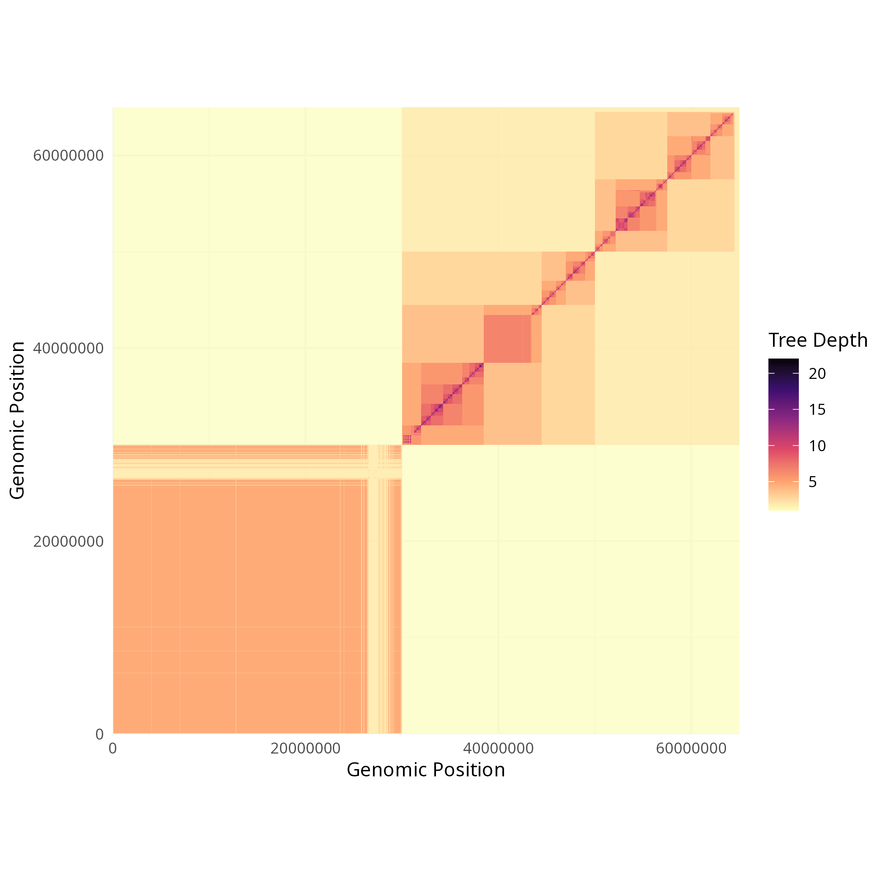
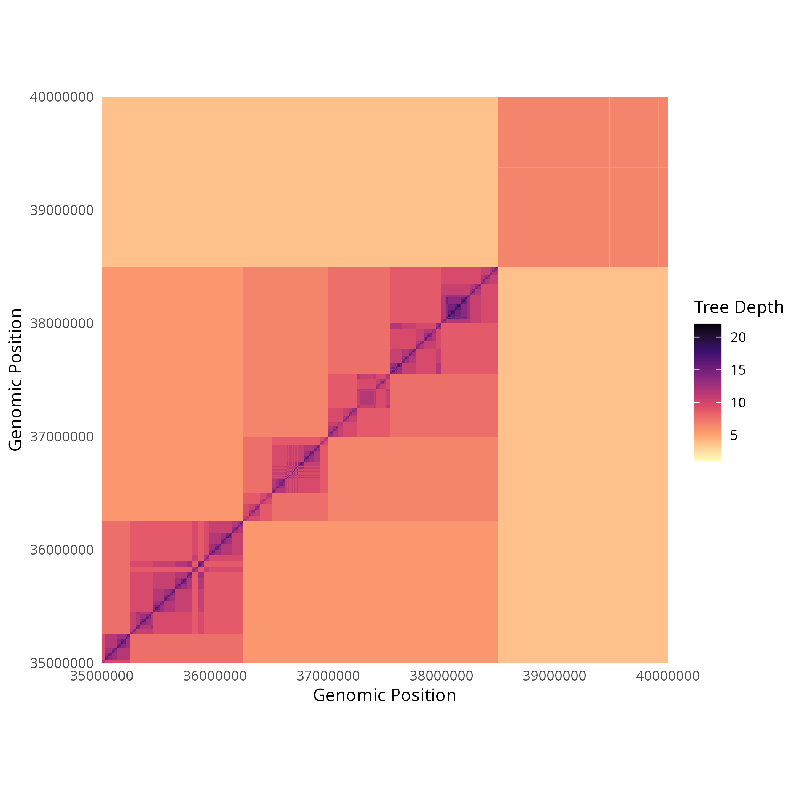
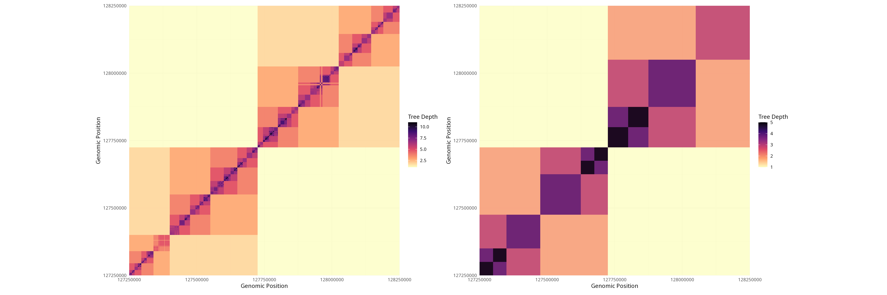
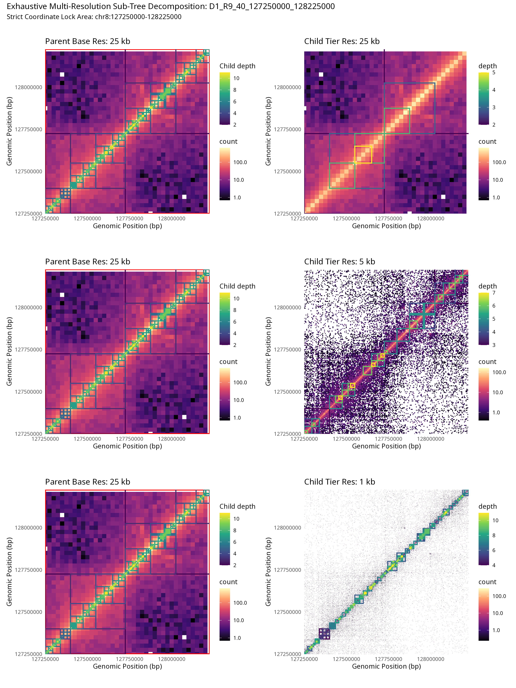
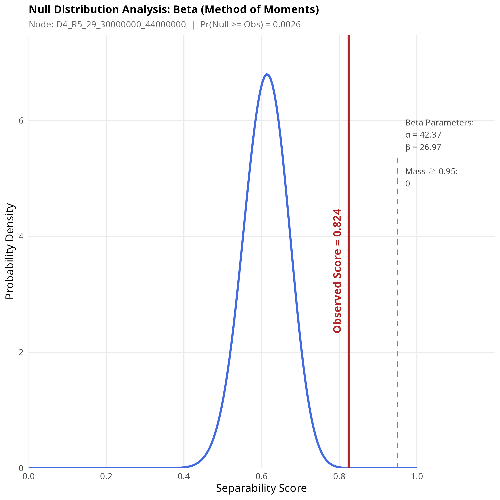
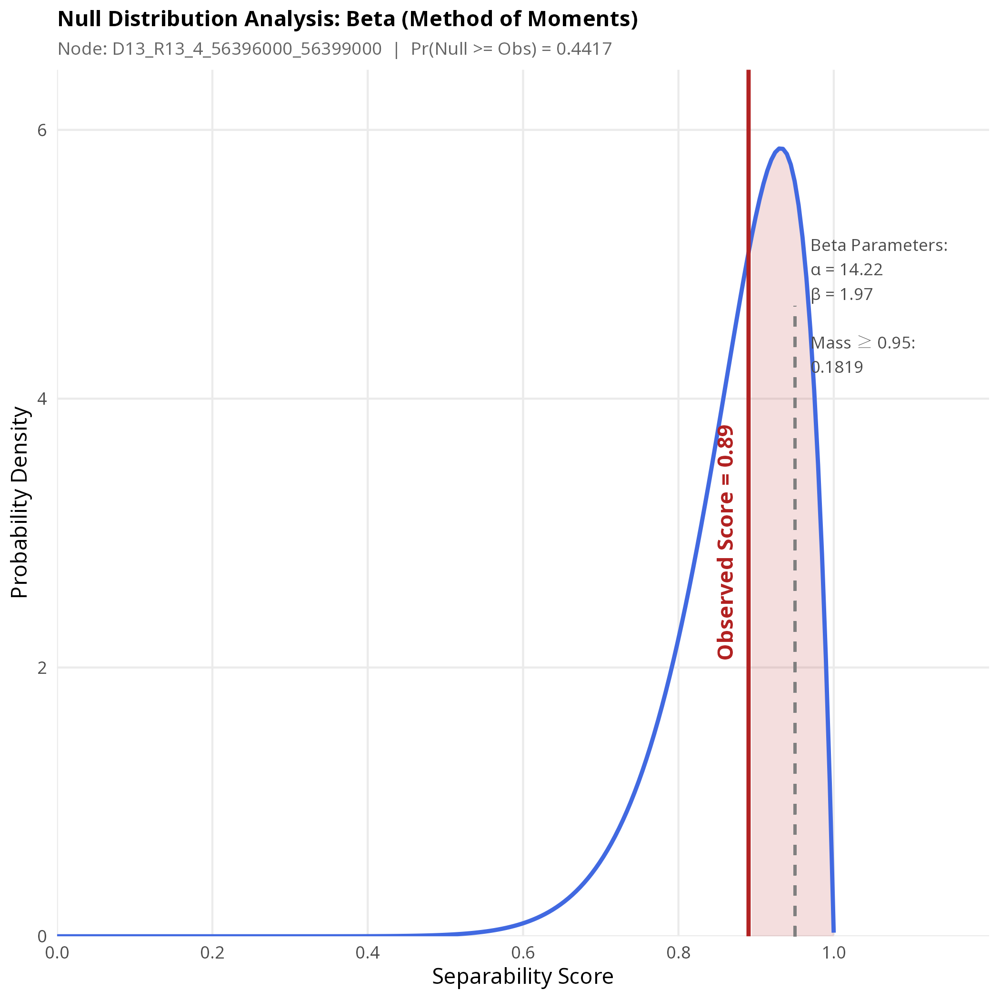

# BHiCect2

<!-- badges: start -->

<!-- badges: end -->

The goal of BHiCect2 is to cluster HiC data as described in our [manuscript](). <!-- markdownlint-disable-line MD042 -->
Briefly, we decompose intra-chromosomal HiC data into nested clusters of preferentially self-interacting chromosome regions across all resolutions.


---

# `BHiCect2` — High-Resolution Chromatin Domain & Cluster Detection

`BHiCect2` is an R package tailored for computational biologists and bioinformaticians looking to extract high-confidence chromatin clusters from Hi-C data. By interfacing natively with modern `.mcool` and `.hic` data formats via `hictkR`, `BHiCect2` handles multi-resolution tracking, cluster identification, and bootstrapping-based cluster significance at genomic scale.

## Key Features
* **Native Multi-Res Support:** Direct indexing of `.mcool` files via lightning-fast C++ backend interfaces (`hictkR`).
* **Surgical Locus Analysis (`BHiCect_Locus`):** Skip whole-chromosome processing to focus exclusively on specific gene neighborhoods, TADs or transcriptional hubs.
* **Non-Contiguous Interaction Networks:** Capture dynamic spatial architecture where disconnected linear regions (e.g., distant super-enhancers looping to promoters) are mathematically grouped into a single structural cluster.
* **Multi-Resolution Heatmap visualisations:** Generate various heatmap figures, perfect for tracing how a single parent domain fractures into child loops or comparing wild-type loops against degraded/altered states.
* **Interoperable Data Layouts:** Seamless conversion of hierarchical clusters into Bioconductor-native `GRangesList` objects for downstream multi-omic integration.
---

## 📖 Quick Start Guide

### 1. Global Chromosome-Wide Clustering

Load your multi-resolution Hi-C data and execute the core `BHiCect` clustering algorithm over a target chromosome.

```R
library(BHiCect2)
library(hictkR)

# Prevent scientific notation on genomic coordinates
options(scipen = 9999)

# Load multi-resolution Hi-C data (.mcool format)
mcool_path <- "path/to/your/dataset.mcool"
current_MresFile <- hictkR::MultiResFile(mcool_path)

# Execute tree-based clustering algorithm on target chromosome
res_obj <- BHiCect(current_MresFile, chrom = "chr20", threshold = 0.5)

# (Optional) Save your computed result object
saveRDS(res_obj, file = "chr20_res_obj.rds")

```
### 2. Targeted Locus Analysis & Multi-Resolution Visualisation (New ✨)
Isolate a specific genomic interval of interest (e.g., a pre-called TAD or a gene neighborhood) and execute top-down recursive spectral decomposition. 

```R 
# Dissect the MYC locus environment down to fine-resolution sub-structures
myc_locus_tree <- BHiCect_Locus(
  MresFile  = current_MresFile,
  chrom     = "chr8",
  tad_start = 127235000, 
  tad_end   = 128243000, 
  start_res = 25000,     # Initialize root clustering at 25kb to anchor the domain
  threshold = 0.45       # Spectral split sensitivity threshold
)
```
### 3. Heatmap visualisation of clustering
`BHiCect2` clusters are best visualised as an interaction heatmap. You can distribute this workload effortlessly using a `future` execution plan.

```R
library(future)
library(furrr)

# Extract cluster table
summary_tbl <- res_obj$nodes

# 1. Spawn parallel workers based on your infrastructure (e.g., 4 cores)
plan(multisession, workers = 4)
# 2. Compute spatial geometric coordinates in parallel
global_geometry <- compute_cluster_rectangles(summary_tbl, current_MresFile)
# 3. Terminate background processes cleanly to liberate system RAM
plan(sequential)

# Plot global contact heatmap with identified clusters
## Chromosome-wide
plot_cluster_heatmap(global_geometry)
## Interval of interest
plot_cluster_heatmap(global_geometry,xlim=c(3.5e7,4e7))


```
#### Chromosome-wide heatmap


#### Region of interest


This visualisation is particularly useful to evaluate changes in chromatin architecture following specific treatment as illustrated below with the effect of auxin mediated depletion of cohesin at the MYC locus.




We also have dedicated functions to integrate our clustering results with the original HiC data across all resolutions used




Since this function outputs a ggplot object it can be integrated with other omics plots using plotgardener or patchwork.

### 3. Diagnostic Visualization & Density Profiling

Evaluate the geometric properties of detected clusters and analyze localized bootstrap densities for micro-domains.

```R
# Bootstrap validation plots for specific cluster targets
plot_node_density_boot("D4_R5_29_30000000_44000000", summary_tbl)
plot_node_density_boot("D13_R13_4_56396000_56399000", summary_tbl)

```
#### Robust cluster

#### Ambiguous cluster

### 4. Downstream Integration (Bioconductor Ecosystem)

Easily transition your clustering results into standard genomic ranges for multi-omics integration.

```R
# Coerce result object into a GenomicRanges::GRangesList object
cluster_GRanges <- as_granges_list(summary_tbl, current_MresFile, chrom = "chr20")

# Ready for downstream packages like GenomicRanges, plyranges, or ChiPseeker
print(cluster_GRanges)

```

---

## Output Formats

* **`res_obj$nodes`**: A clean, parsed hierarchical data frame indexing cluster IDs, parent-child nodes, and raw coordinate metrics.
* **`cluster_GRanges`**: A standard `GRangesList` metadata framework containing distinct genomic coordinates mapping back to cluster groups.
